# DownTik-Mac 🎬🔥

Other version?
look at
[Windows](https://github.com/antoneeh10/DownTik-Windows)
[Android](https://github.com/antoneeh10/DownTik-Android)
[Linux](https://github.com/antoneeh10/DownTik-Linux)
-----
An Open Source TikTok Multimedia Downloader for macOS, built with **Electron** and powered by automated **GitHub Actions** workflows.

---

## 🚀 Core Features Matrix (Desktop Edition)

#### 🎬 Main & Media Downloader
* **Video Downloader Core:** Fetches TikTok video metadata instantly using the TikWM API.
* **Advanced Video Preview:** Interactive thumbnails that can be clicked to enter a smooth fullscreen preview window, featuring a play button overlay designed with Material Expressive Player guidelines.
* **Audio Extractor Tab:** A dedicated tab with a specific **"Get Audio"** button to isolate and extract audio tracks directly from TikTok videos.
* **Smart Storage Matrix:** Downloaded files are automatically sorted into dedicated local directories:
  * 📁 `Downloads/DownTik/Video`
  * 📁 `Downloads/DownTik/Audio`
* **Persistent History Log:** Keeps a local record of your download history, allowing you to easily browse and view previously downloaded multimedia files.

#### 📤 Share System & Clipboard Integration
* **Auto-Clipboard Listener:** Optimized for desktop environments; it automatically detects TikTok URLs copied to your macOS system clipboard.
* **Seamless Input:** When the application is launched or maximized, the detected TikTok link is automatically pasted into the input field without requiring manual actions.
* **Crash Protection:** Strict validation mechanics filter out invalid links and non-URL text, preventing application freezes or crashes.

#### 🔄 3-Channel Update System
The application integrates directly with the **GitHub Releases API** to monitor and deliver updates seamlessly:
* **3 Distribution Channels:** Supports `Stable` (v1.2.5), `Beta` (v1.2.5-beta.x), and `Nightly` (automated daily builds) channels.
* **Smart Cache & Traffic Optimization:** Utilizes persistent caching with `ETag` and `304 Not Modified` headers to conserve bandwidth and prevent API rate-limiting issues.
* **Interval Scheduler:** Runs an automated background update check every **6 hours**, with a manual check button available in Settings to bypass the interval restriction.
* **Security Digest Verification:** Downloaded installation packages must pass a strict `SHA-256` checksum verification to ensure package integrity before installation.

#### 💝 Developer Support
An option bar placed next to the history button allows users to support the project's sustainability:
* **Donate Button:** Triggers an interactive dialog offering both local and international donation platforms:
  * 🇮🇩 **Saweria** (For Indonesian local e-wallets/QRIS)
  * 🌎 **SociaBuzz** (For international payment methods)
  * *Developer Message:* `"berikan donasi untuk fitur baru aplikasi DownTik dan domain web. kalau gak ada, gakpapa, gak dipaksa kok :)"`
* **See an Ads Confirmation:** Displays a native confirmation dialog before loading ad placements inside an isolated sandbox window, ensuring users are never forcefully redirected to an external browser.

#### 🌐 Bilingual Support & Localization
* **Built-in Multi-language Engine:** Complete native localization for 🇮🇩 **Bahasa Indonesia** and 🇬🇧 **English**, covering all components, dialogs, button triggers, error messages, and accessibility content descriptions.
* **Flexible Toggles:** Language settings can be reconfigured dynamically at any time via the **Settings** panel.
* **👋 Onboarding Screen (First-Run Intro):**
  * **Slide 1:** Welcome introduction highlighting key multimedia features (Video, Audio, History, Multi-channel updates).
  * **Slide 2:** Quick preference toggle to pick the default interface language (Bahasa Indonesia / English).
  * *Onboarding states are saved persistently upon completion, ensuring it never interrupts subsequent app launches.*

#### 🛡️ Reliability & Security Architecture
* **Zero Hardcoded Secrets:** No personal access tokens, GitHub PATs, or API keys are stored within the source code.
* **Strict HTTP Stream Handling:** Network requests utilize optimized libraries, ensuring all HTTP response streams are closed explicitly to eliminate memory leaks.
* **Graceful Cancellation:** Canceling active downloads is handled gracefully without logging an application error state, and temporary cache files are wiped instantly.
* **Code Minification:** JavaScript source files and application assets are bundled and minified using optimized compilation rules for crisp macOS desktop performance.

---

## 🧩 User Experience Architecture (UX Structure)

```text
                    DownTik (Mac Desktop)
                              │
               ┌──────────────┴──────────────┐
               │                             │
            Video                          Audio
               │                             │
          Get Video                       Get Audio
               │                             │
               └────────── Download ─────────┘
                              │
                     Download/DownTik/
                        ├── Video
                        └── Audio

Top Actions Bar:
[ Donate 💝 ]   [ See an Ads 📺 ]   [ History 📜 ]

External Input:
System Clipboard Copy (TikTok URL) → Auto Detect → Fill Downloader
```

---

## 🎨 Visual Step-by-Step Guide: How to Fork, Build, and Download DownTik macOS Installer

#### Step 1: Navigating the Source Repository
First, open the main public hub of the project at `https://github.com` to view the baseline file architecture layout.
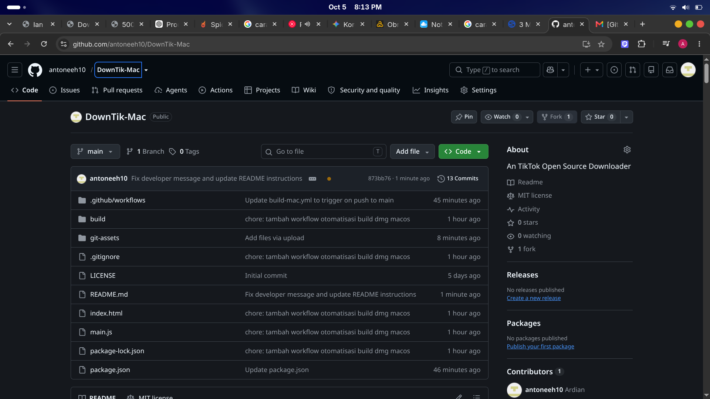

#### Step 2: Initiating the Fork Action
Click the **Fork** button located at the top-right corner of the main page header to pull up the replication configuration form.
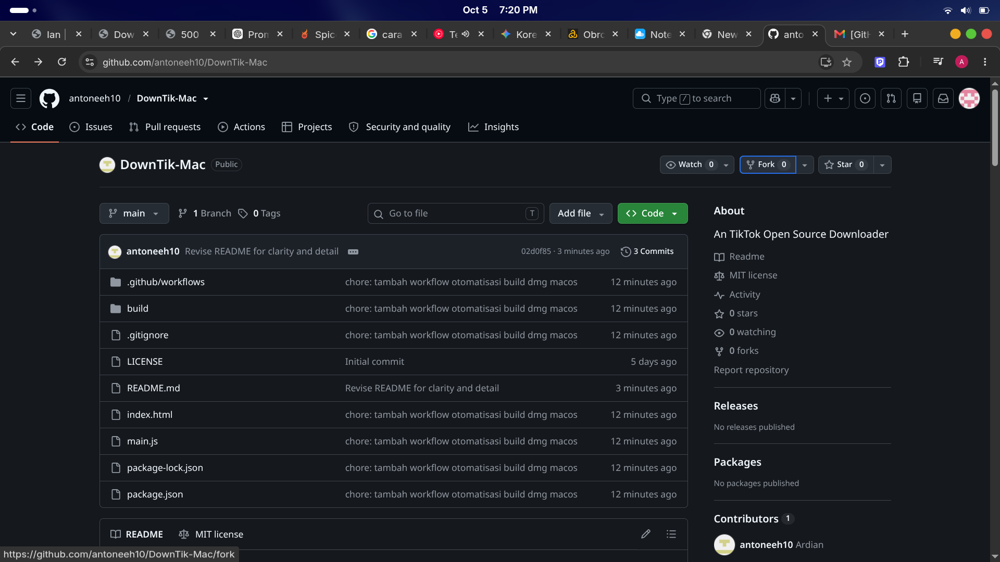

#### Step 3: Setting Up Your Personal Repository Name
On the setup page, verify your personal account space under the **Owner** drop-down menu. Inside the **Repository name** field, type any folder name you prefer for your project workspace.
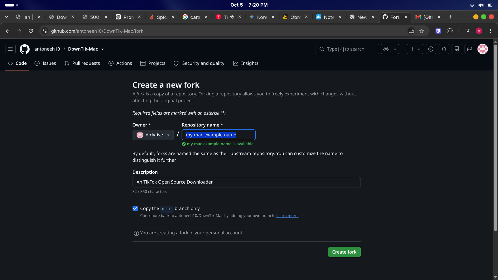

#### Step 4: Clicking the Create Fork Confirmation
Keep the main branch copying option checked, scroll down to the absolute bottom of the setup options, and click the green **Create fork** confirmation button.

#### Step 5: Waiting for the Duplication Process
A loading sync interface will prompt briefly while the cloud platform framework clones the remote repository file system into your user space.
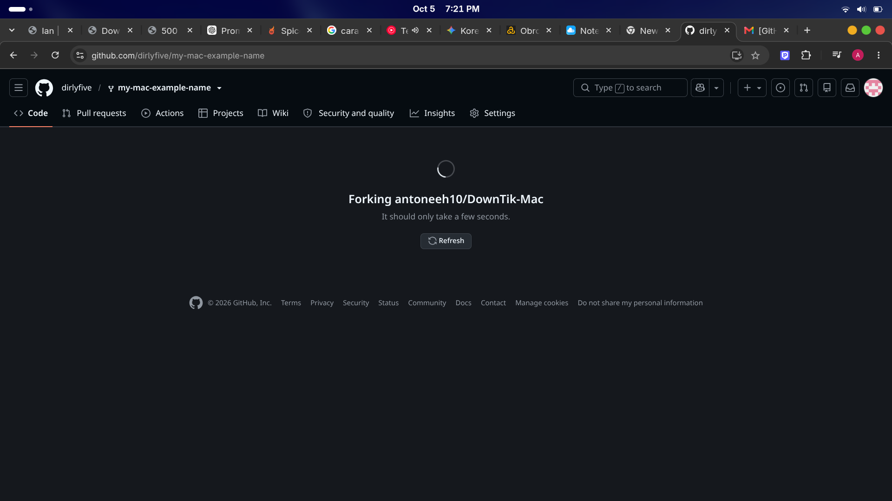

#### Step 6: Opening Your Forked Repository Home
Once the cloning process finishes, you will be automatically redirected to your personal workspace project directory layout.
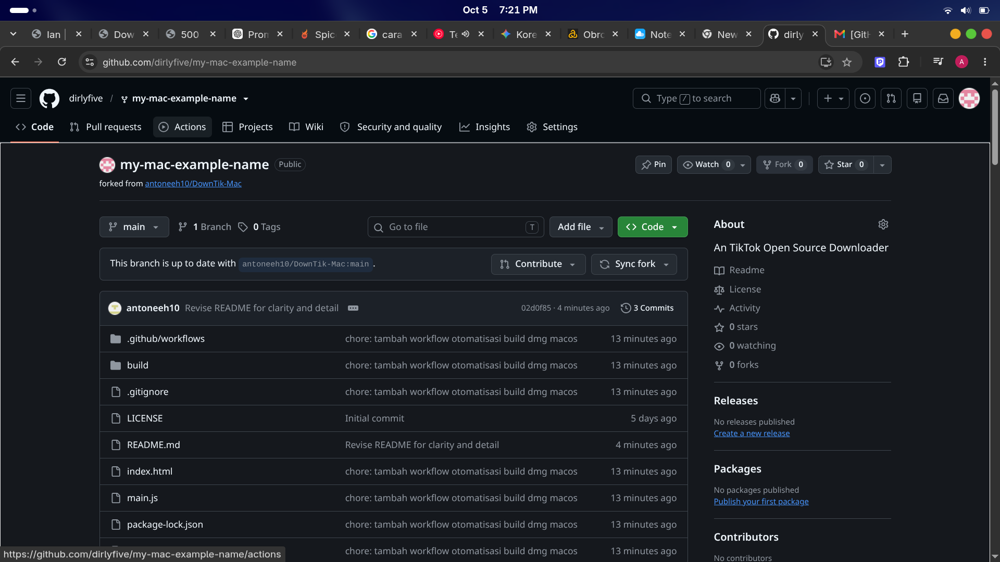

#### Step 7: Opening the Actions Tab on Your Fork
Click on the **Actions** tab located on the top navigation row bar of your personal forked repository home page.
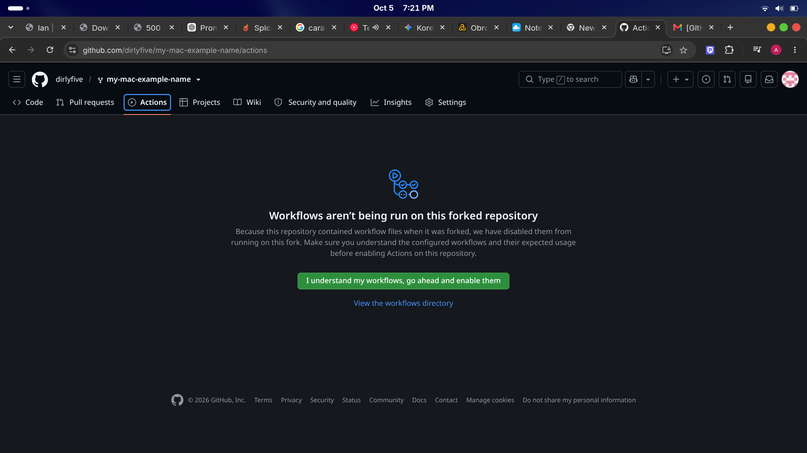

#### Step 8: Unlocking Workflow Restrictions
Because this is a cloned project configuration, GitHub blocks action scripts by default. Click the large green statement block button to grant active execution privileges.

#### Step 9: Accessing the Build Control Environment
After granting access privileges, the workflow tracking engine clears into an active dashboard layout ready for run deployments.
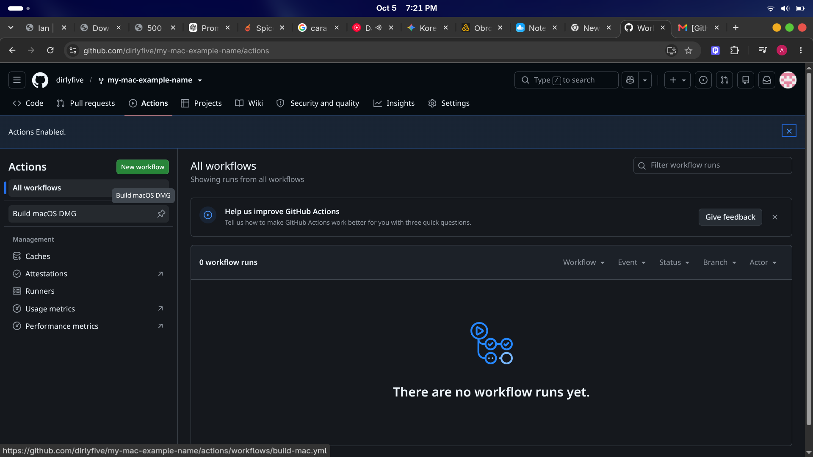

#### Step 10: Selecting the Build Target Module
Under the action directory menu items listed on the left sidebar layout, look for the automated build modules and click on **"Build macOS DMG"**.
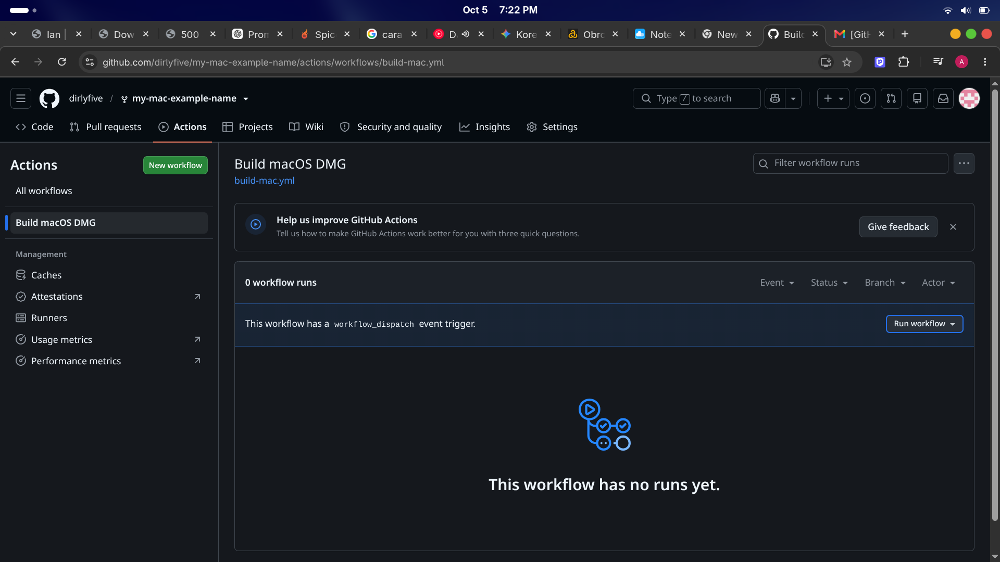

#### Step 11: Launching the Automated Compiler Script
Look towards the right-hand panel view and click the gray **"Run workflow"** toggle box. When the inner context card overlay prompts, click the green inner **"Run workflow"** confirmation button.
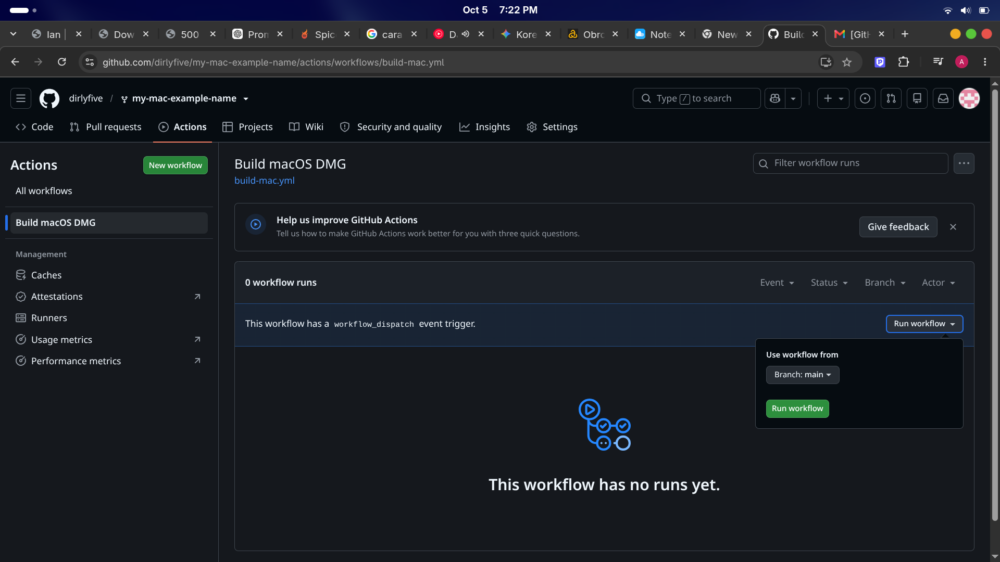

#### Step 12: Monitoring the Cloud Runner Infrastructure Queue
The newly triggered execution instance will dynamically append to your active runs listing row, initializing under a queued operation status flag.
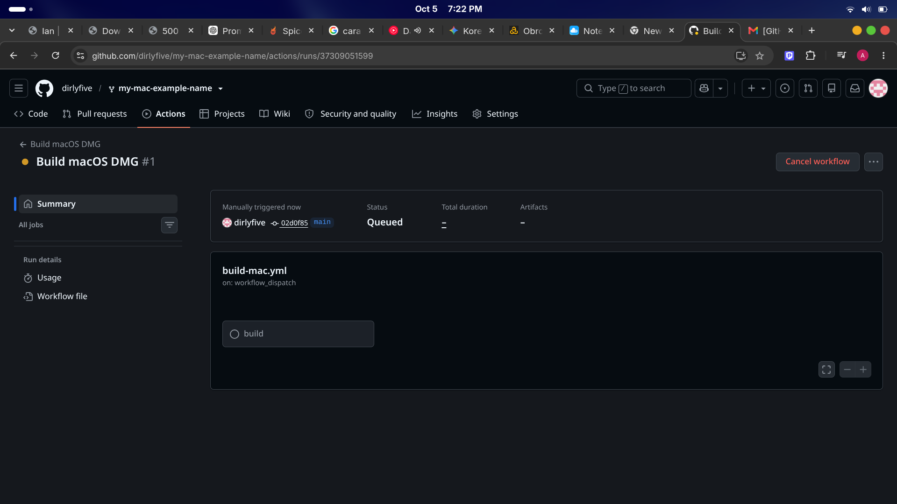

#### Step 13: Watching the Virtual Environment Compilation Execution
The pipeline tracks real-time script outputs as the background virtual cloud server unpacks code dependencies and packages software frameworks.
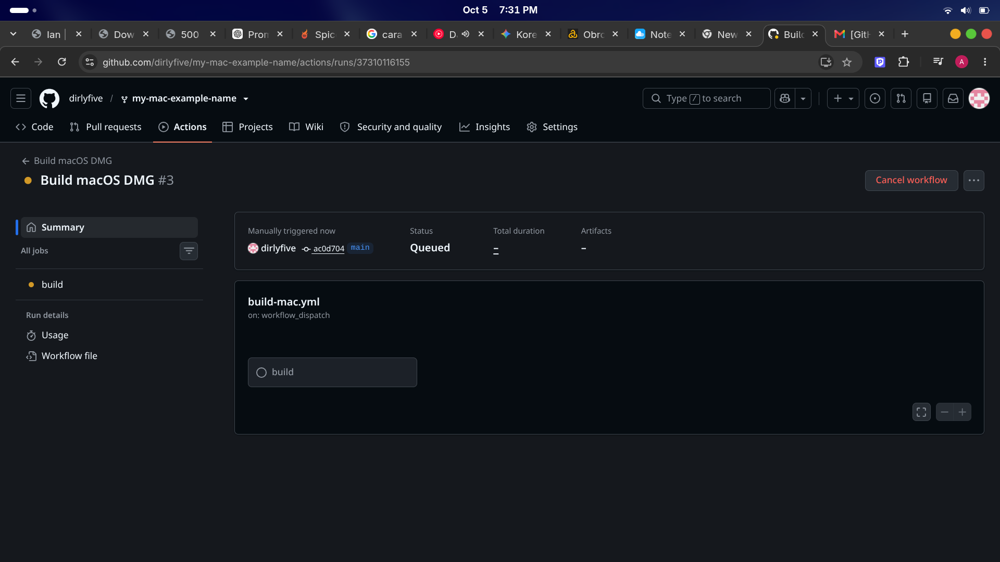

#### Step 14: Confirming Verified Success Execution Marks
Wait around 1 to 2 minutes until all operational steps resolve completely into stable **green checkmarks** showing a success completion status.
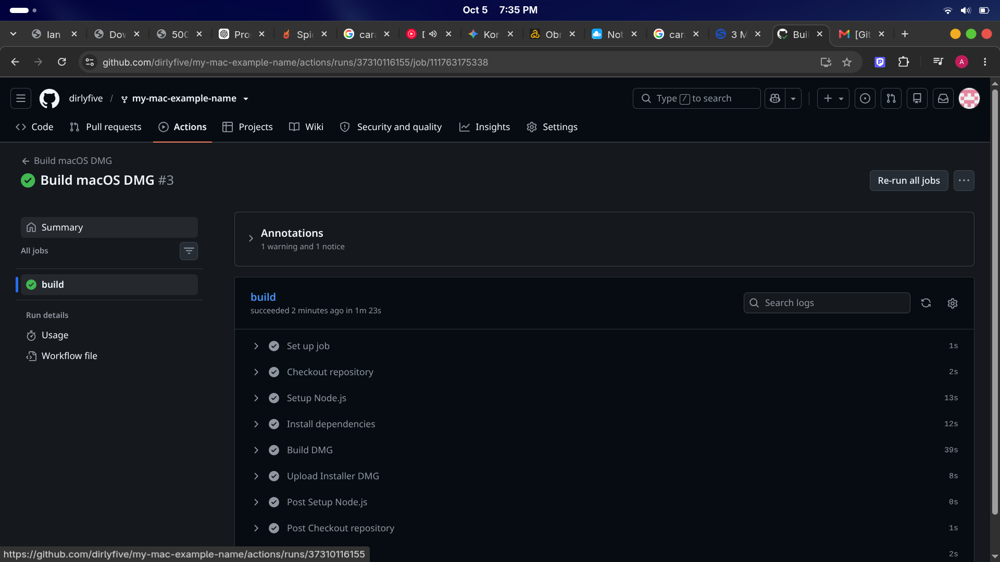

#### Step 15: Downloading and Extracting the Local Archive Folder Package
Scroll down to the bottom of the successful run summary page to access the generated artifacts. Click the blue download asset bundle link named **DownTik-macOS-DMG** to download the package file. Locate the downloaded file `DownTik-macOS-DMG.zip` inside your system local file manager interface, right-click on it, and select **Extract** or **Extract to...**.
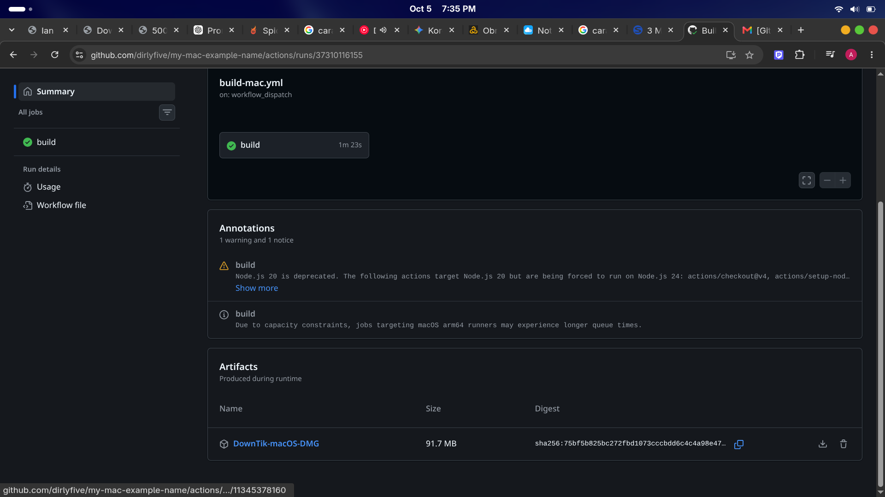

The output extraction process creates a new target folder containing your compiled production-ready disk installer: **`DownTik-1.0.0-arm64.dmg`**!

---

## 🛠️ Local Development (Darwin-Kernel Only)

To run and compile this application locally on your machine:

1. Clone the repository:
   ```bash
   git clone https://github.com.git](https://github.com/antoneeh10/DownTik-Mac
   cd DownTik-Mac
2. Install the Node.js package dependencies:
``` bash
npm install
```
   3. Boot the app in development mode:
   ``` bash
npm start
```
   5. Compile and package the production `.dmg` file locally:
```  bash
npm run build
   ```
